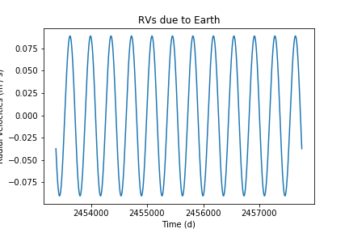
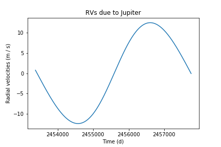
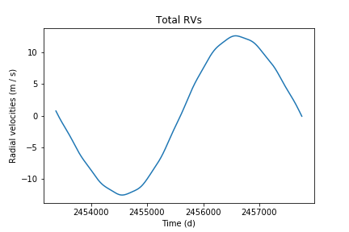

The basics of radial velocities
-------------------------------

We can almost completely characterize the orbits of massive bodies around a star using a set of five orbital parameters for each body. Different parametrization schemes use a different set of five parameters, depending on what kind of optimization is needed, but for this tutorial we will use the one from `Murray & Correia (2010) <https://arxiv.org/abs/1009.1738)>`_:

* :math:`K`: radial velocity semi-amplitude
* :math:`T`: orbital period
* :math:`e`: eccentricity of the orbit
* :math:`\omega`: argument of periapse
* :math:`t_0`: time of periapse passage

These parameters exist for each body orbiting a star.

In this notebook, we will play around with the package ``radial`` to simulate radial velocity curves for a star orbited by bodies with different orbital parameters.

.. code:: python

    from radial import object
    import astropy.units as u
    import numpy as np
    import matplotlib.pyplot as plt

Let's start with a very familiar object: the Sun.

**Note:** if you are too lazy to convert units like me, I recommend using the ``astropy.units`` module.

.. code:: python

    sun = object.MainStar(mass=1 * u.solMass, name='Sun')

Now let's setup a couple of companions for the Sun. How about Earth and Jupiter?

Thei radial velocity semi-amplitude is not easily accessible from online databases, but we can compute them using the following equation:

.. math::
    K = \frac{m \sin{I}}{m + M} \frac{2\pi}{T} \frac{\ a}{\sqrt{1-e^2}} \mathrm{,}

where * :math:`m` is the companion mass, * :math:`M` is the mass of the main star, * :math:`I` is the inclination angle between the reference plane and the axis of the orbit (let's consider * :math:`I = \pi` in this example) and * :math:`a` is the semi-major axis of the orbit. All these parameters are easily accessible to us.

.. code:: python

    def compute_k(mass, period, semia, ecc, i=np.pi * u.rad):
        return mass / (mass + 1 * u.solMass) * 2 * np.pi / period * semia / (1 - ecc ** 2) ** 0.5

    # Computing K for the Earth
    mass_e = 1 * u.earthMass
    semia_e = 1.00000011 * u.AU
    period_e = 1 * u.yr
    ecc_e = 0.01671022
    k_e = compute_k(mass_e, period_e, semia_e, ecc_e)

    # Computing K for Jupiter
    mass_j = 1 * u.jupiterMass
    semia_j = 5.2026 * u.AU
    period_j = 11.8618 * u.yr
    ecc_j = 0.048498
    k_j = compute_k(mass_j, period_j, semia_j, ecc_j)

    # Setting up the companions
    earth = object.Companion(main_star=sun,
                             k = k_e,
                             period_orb=period_e,
                             t_0=2457758.01181 * u.d,    # Time of periastron passage, Julian Date
                             omega=114.207 * u.deg,      # Argument of periapsis/perihelion
                             ecc=ecc_e)

    jupiter = object.Companion(main_star=sun,
                               k=k_j,
                               period_orb=period_j,
                               t_0=2455636.95833 * u.d,
                               omega=273.867 * u.deg,
                               ecc=ecc_j)

The next step is to setup the Solar System with the Sun and its planetary companions. We need to state what is the time window that we want to simulate in Julian Dates.

.. code:: python

    time = np.linspace(2453375, 2457758, 1000) * u.d    # ~12 years

    # The Solar System
    sys = object.System(main_star=sun,
                        companion=[earth, jupiter],
                        time=time)

Now to compute the radial velocities of the Sun due to Earth and Jupiter:

.. code:: python

    sys.compute_rv()

With the radial velocities finally computed, it's time to plot them. Let's take a look at the RVs caused by the Earth on the Sun:

.. code:: python

    sys.plot_rv(0, 'RVs due to Earth')
    plt.show()

And the total RVs (including Jupiter) are shown below:

.. code:: python

    sys.plot_rv(1, 'RVs due to Jupiter')
    sys.plot_rv(plot_title='Total RVs')
    plt.show()

